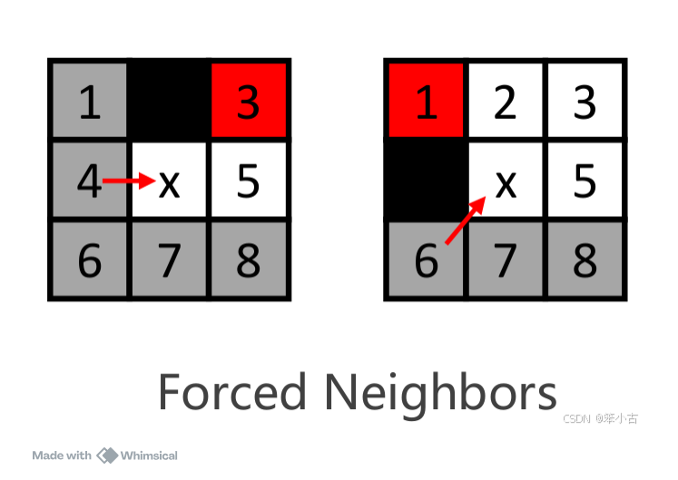
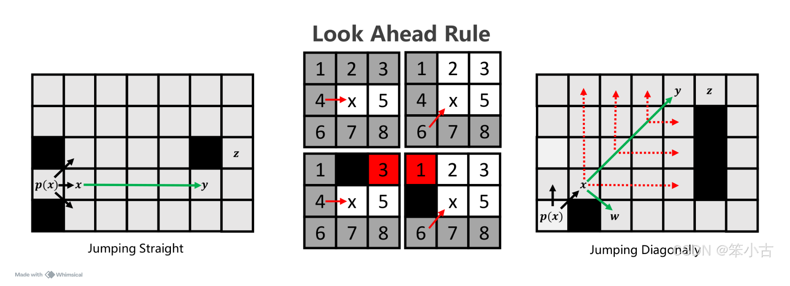

# **Readme**

* [reference in paper](https://github.com/lyteen/DS/algori/Jump_Search_Algorithm/refes) 

## **Function**

main function in `src\jps.cc`

1. **heuristic**
    
    get the curr-node to target-node cost

2. **findForcdNeighbor**

    find the forced neighbor node

    forced neighbor situation like:
    

3. **Jump**

    recursion the generally nodes until find the forced neighbor node or goal node
    
    main idea:
    

4. **plan**

    use the priority queue to store the move to node(forced neighbor node)

5. **visualize_grid**

    thought the visited<vector<pair<int x, int y>>> visualize the path.