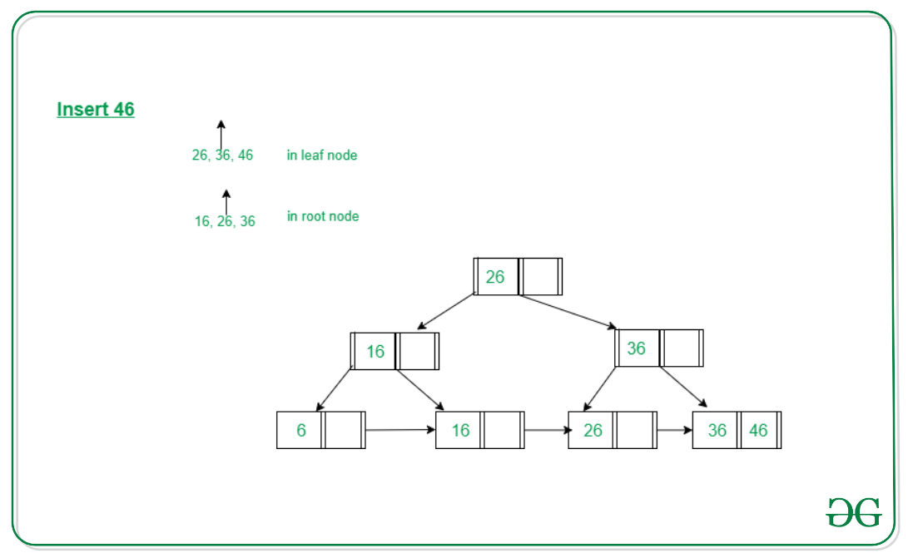

# **BPlusTree**

    
    main idea:
    1. only leaf node save values(data) and structure is single list
    
    2. leaf node upper internal node keys is relative with right child_leaf_node. e.g. parents->keys: `"3"`, right_child_leaf->keys.begin(): `"3"`
    
    3. nonleaf (no relative with leaf) keys is before split node Midkey. e.g. origin: `"3", "4", "5"` -> left: `"3"`, parents: `"4"`, right: `"5"`. 
    like `"26"`:

structure in `include\.hpp`
src code in `src\.cc`
    node operator: `BNode.cc`
    BPlusTree implement: `BPLusTree.cc`

# **Node**

1. **InsertNoFull**

    leaf_node: insert element
    internal_node: judge is_full ? this->splitChild : child_node inertNoFull
    
2. **SplitChild**

    leaf_node: `full_node->element[begin: mid], new_node->element[mid: end]`
    internal_node: `full_node->element[begin: mid], new_node->element[mid + 1: end]`
    parent_node: `add element[mid]`

3. **Search**

    recusion from internal_node to leaf_node print element

4. **DeleteNode**

    leaf_node: `erase element[key]`
    internal_node: `judge is_UnderFlow ? this->HandleUnderflow : child_node->DeleteNode`

    - **HandleUnderflow**
    
        check the node is exist and keys.size() > Minkeys
        from left_node to right_node: BorrowFrom->MergeWith

    - **BorrowFromLeftSibling**

        leaf_node: `current_node insert left_node->element.back(), parent cope left_node->element.back(), left_node->element.pop_back();`
        internal_node: `same`
        

    - **BorrowFromRightSibling**

        leaf_node: `current_node insert right_node->element.front(), parent cope left_node->element.front(), right_node->element.erase[begin];`
        internal_node: `same`
        

    - **MergeWithLeftSibing**

        leaf_node: `move current_node all element to left_node, parent_node erase current key, delete current_node.`
        internal_node: `move and erase parent_node current key to left_node, same.`

    - **MergeWithRightSibing**

        leaf_node: `move right_node all element to current_node, parent_node erase next key, delete right_node.`
        internal_node: `move and erase parent_node next key to current_node, same.`

